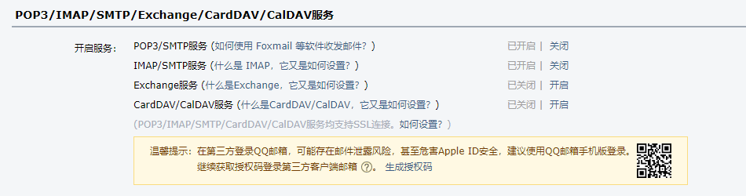
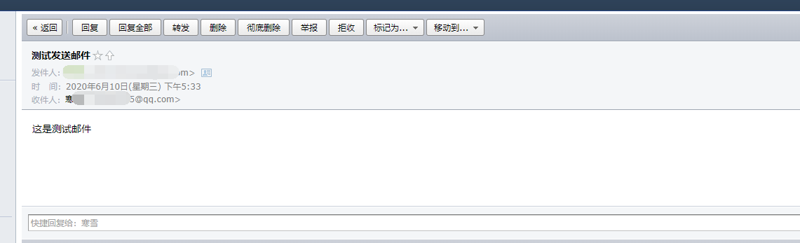

# 使用Volo.Abp.MailKit发送邮件

>  Volo.Abp.MailKit封装继承MailKit库，为Abp邮件发送提供了快捷实现。

#### 邮箱配置

qq邮箱支持smtp功能，需要去申请开通。[参考qq邮箱设置](https://service.mail.qq.com/cgi-bin/help?subtype=1&&id=28&&no=331)，最重要的是smtp发送邮件，qq邮箱对应的密码不是用户的qq邮箱密码，而是需要申请生成的授权码。



在项目的appsettings.json配置文件里，添加如下配置项目。

```json
"Settings": {
    "Abp.Mailing.DefaultFromAddress": "xx@qq.com",
    "Abp.Mailing.DefaultFromDisplayName": "xx",
    "Abp.Mailing.Smtp.Host": "smtp.qq.com",
    "Abp.Mailing.Smtp.Port": "587",
    "Abp.Mailing.Smtp.Domain": "smtp.qq.com",
    "Abp.Mailing.Smtp.UserName": "xx@qq.com",
    "Abp.Mailing.Smtp.Password": "xxx",
    "Abp.Mailing.Smtp.EnableSsl": "false",
    "Abp.Mailing.Smtp.UseDefaultCredentials": "false"
  }
```

*注意*

1. Abp.Mailing.Smtp.EnableSsl项目应设置为false。

2. Abp.Mailing.Smtp.UseDefaultCredentials项目应设置为false。
3. Abp.Mailing.Smtp.Password应设置为qq邮箱对应的授权码密文。

> 密文可调用IStringEncryptionService.Encrypt(授权码)获取

#### 发送邮件

在一个后台作业里发送邮件，完整代码如下。

```c#
 public class EmailSendingJob : BackgroundJob<EmailSendingArgs>, ITransientDependency
    {
        private readonly IMailKitSmtpEmailSender _emailSender;
        public EmailSendingJob(IMailKitSmtpEmailSender emailSender)
        {
            _emailSender = emailSender;
        }

        public override void Execute(EmailSendingArgs args)
        {
            Action action = async () =>
            {
                await _emailSender.SendAsync(
                    args.EmailAddress,
                    args.Subject,
                    args.Body,
                    false
                );
            };
            action?.Invoke();
        }
    }
```

看看测试效果，邮件正确的发送接收了。



#### 配置邮箱密码使用明文

> 框架默认EmailSettingProvider设置EmailSettingNames.Smtp.Password的isEncrypted属性默认为true，所以在上面的appsettings.json中需要设置为授权码的密文。

根据官方的文档，我们可以修改EmailSettingNames.Smtp.Password的isEncrypted属性默认为false，这样就可以直接使用授权码明文。

在项目中新建一个MySettingDefinitionProvider文件，并继承自SettingDefinitionProvider类。

```c#
 public class MySettingDefinitionProvider : SettingDefinitionProvider
    {
        public override void Define(ISettingDefinitionContext context)
        {
            var smtpPassword = context.GetOrNull("Abp.Mailing.Smtp.Password");
            if (smtpPassword != null)
            {
                smtpPassword.IsEncrypted = false;
            }
        }
    }
```

[官方参考文档](https://docs.abp.io/en/abp/latest/Settings)