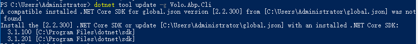

## dotnet tool 无法安装、更新

在更新abp cli时，提示如下：



通过信息，可以知道指定的sdk是2.2.300版本，但本机未安装，找到*C:\Users\Administrator\global.json*文件，可以看到里面指定的确实是2.2.300，将其修改为本机安装的sdk版本3.1.201，然后再执行abp tool update命令

```powershell
dotnet tool update -g Volo.Abp.Cli
```

可以到dotnet tool已经更新到了最新版本，又可以愉快的使用了。


